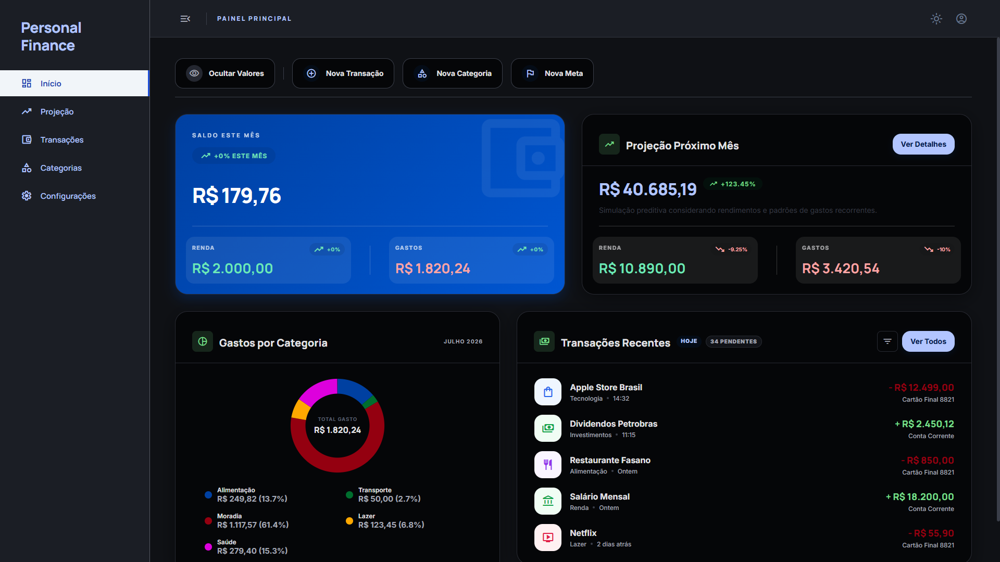
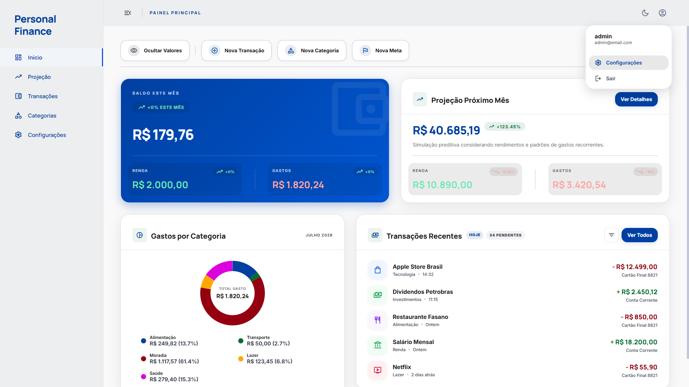
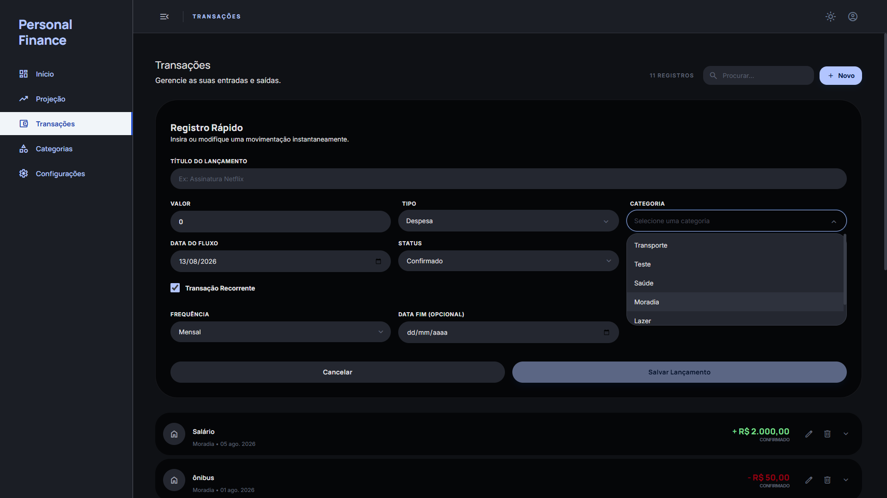
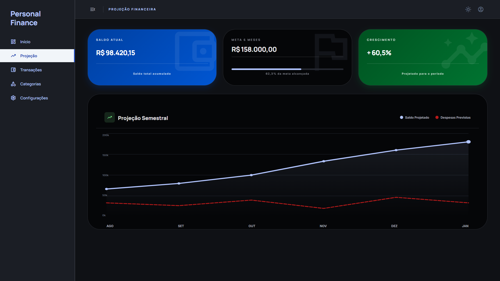
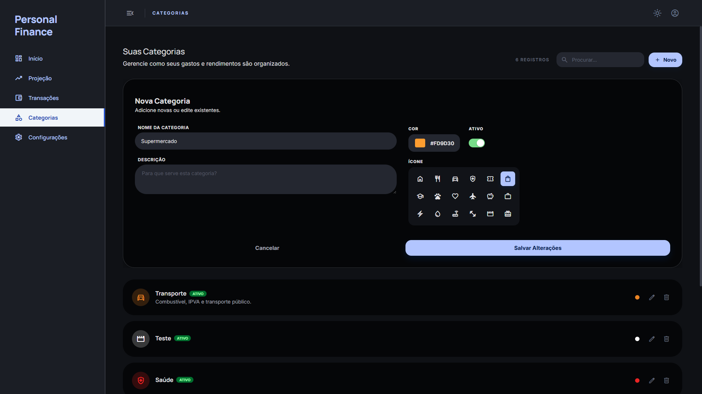
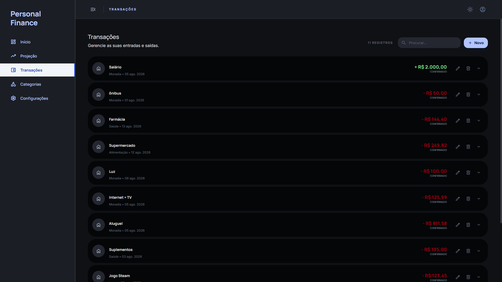
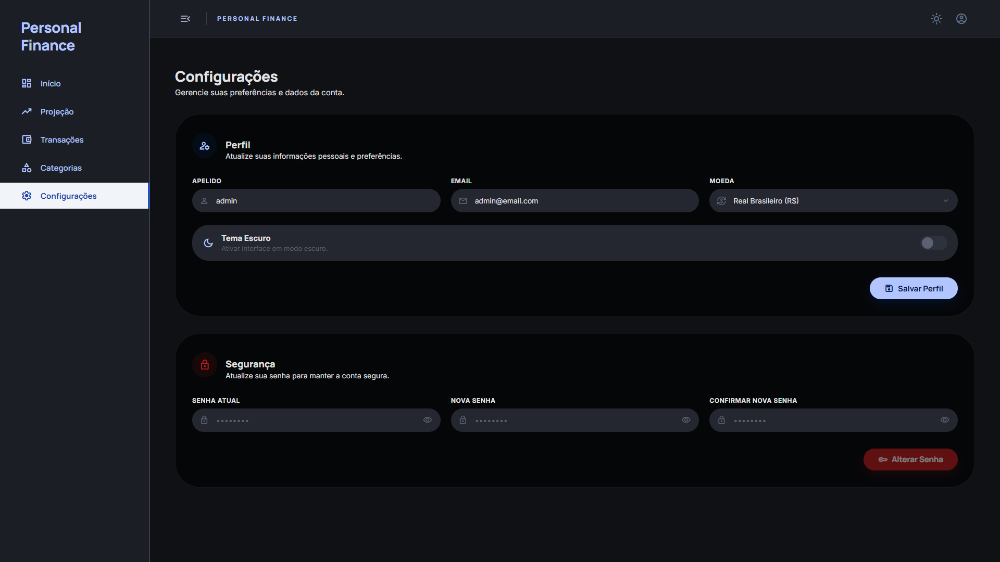
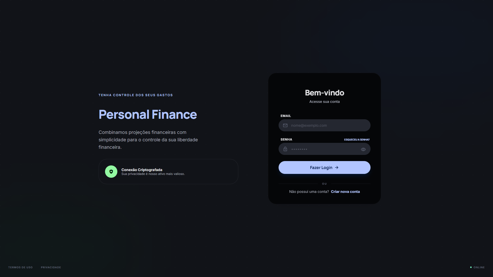
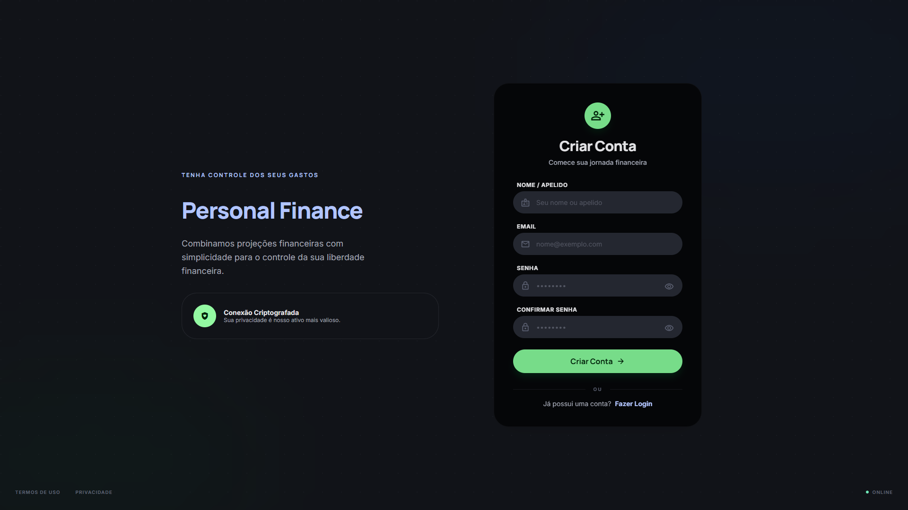

# Personal Finance Dashboard 🚀

A modern, enterprise-grade, cross-platform Personal Finance Management application built to demonstrate advanced software engineering practices, scalable architecture, and cutting-edge web/mobile technologies.

This repository contains both the **Frontend** (Angular/Ionic) and the **Backend** (.NET 10 Clean Architecture API).


---

## 📸 Application Screenshots

*(Replace the placeholder links below with actual screenshots of your application)*

### 📱 Dashboard & Finances

| Dashboard (Dark Mode) | Dashboard (Light Mode) | Transaction Entry | Financial Projections |
|:---:|:---:|:---:|:---:|
|  |  |  |  |
| *Overview & balance (Dark)* | *Clean UI in Light theme* | *Income & expense entry* | *Future balance calculations* |

### ⚙️ Management & Configuration

| Categories Management | Transactions Management | Settings & Preferences |
|:---:|:---:|:---:|
|  |  |  |
| *Custom hierarchy & tagging* | *Manage income, expenses, and recurring transactions* | *Theme, currency & profile settings* |

### 🔐 Authentication Flow

| Login | Register |
|:---:|:---:|
|  |  |
| *Login (with JWT authentication)* | *New account registration* |


---

## 🌟 Highlighted Features

- **Cross-Platform Experience**: Runs natively on Web, iOS, and Android from a single codebase using Ionic and Capacitor.
- **Enterprise-Grade Backend**: Built on .NET 10 utilizing Clean Architecture, DDD, and CQRS patterns.
- **Advanced Financial Projections**: Algorithmically calculates future balances based on current funds, recurring income, and expenses.
- **Secure Authentication**: Robust JWT-based authentication protecting user data.
- **Resilient & Scalable**: Asynchronous event handling with RabbitMQ and fast data retrieval through Redis caching.
- **Idempotent Transactions**: Prevents duplicate transaction entries using SHA256 hashing.
- **Audit Logging**: Comprehensive logging using MongoDB to track user actions and state changes.

---

## 🛠️ Technology Stack

This project was carefully crafted using highly sought-after technologies in the modern software development market.

### 💻 Frontend (Client Application)
The frontend is a progressive web app (PWA) and native mobile app utilizing the latest ecosystem tools.
* **Framework**: [Angular 21](https://angular.io/)
* **UI/UX**: [Ionic Framework 8](https://ionicframework.com/) for cross-platform components.
* **Mobile Runtime**: [Capacitor 8](https://capacitorjs.com/) for native iOS/Android compilation.
* **Language**: TypeScript 5.9
* **State Management & Reactivity**: RxJS
* **Testing**: Vitest for ultra-fast unit testing.

### ⚙️ Backend (API)
The backend is a highly decoupled REST API following SOLID principles.
* **Core Framework**: [.NET 10](https://dotnet.microsoft.com/) & ASP.NET Core Minimal APIs
* **Architecture**: Clean Architecture & Domain-Driven Design (DDD)
* **Patterns**: CQRS (via [MediatR](https://github.com/jbogard/MediatR)), Repository Pattern
* **Database (Relational)**: PostgreSQL 12+ & Entity Framework Core 9
* **Database (NoSQL)**: MongoDB (for Audit Logs)
* **Message Broker**: RabbitMQ (Asynchronous Events)
* **Caching**: Redis
* **Validation**: FluentValidation
* **Testing**: xUnit (Unit, Integration, and Functional tests)
* **API Documentation**: Scalar

### 🚀 DevOps & CI/CD
* Docker & Containerization support
* Configurable environments and automated migrations

---

## 🏗️ Project Structure

The repository is structured as a monorepo containing both projects:

```
PersonalFinance/
├── Angular/                    # Frontend Web & Mobile Application
│   └── PersonalFinance/        # Angular 21 + Ionic Project
│
└── API/                        # Backend REST API
    ├── src/
    │   ├── Domain/             # Core Business Rules (Entities, Value Objects)
    │   ├── Application/        # Use Cases (CQRS Commands/Queries)
    │   ├── Infrastructure/     # External Agencies (EF Core, PostgreSQL, Security)
    │   └── API/                # HTTP Endpoints (Minimal APIs, Middleware)
    └── tests/                  # xUnit Test Suites
```

---

## 🚀 Getting Started

### Prerequisites
- Node.js 20+ & npm
- .NET 10 SDK
- PostgreSQL 12+
- Docker (optional, for RabbitMQ/Redis/MongoDB instances)

### Running the Backend

```bash
cd API/src/API

# Update database schema
dotnet ef database update --project ../Infrastructure

# Run the API
dotnet run
```
*API will be available at `https://localhost:5001`. View documentation at `https://localhost:5001/scalar/v1`.*

### Running the Frontend

```bash
cd Angular/PersonalFinance

# Install dependencies
npm install

# Run the development server
npm run start
```
*Application will be available at `http://localhost:4200`.*

---

## Author

Created by **Natog**. 

* [GitHub](https://github.com/natog7)
* [Portfolio](https://your-portfolio.com)

---
*If you liked this project, please consider leaving a ⭐!*
